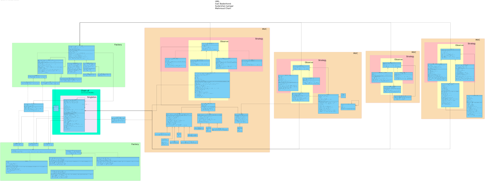

# Final Project Repo

## Description:

This project develops a grid-based game with manual and auto-play modes, featuring a 2D protagonist navigating enemies, health packs, and two visualization options (graphical and text-based). The architecture follows the MV(C) design pattern, leveraging the "world_v6" header file for essential functionalities. 

## UML:
- The UML class diagram below provides an overview of the class structure, relationships, and method signatures. 
Latest update: 03/01/2024

    

## Work Distribution:
For a detailed overview of each member's involvement, please refer to the project's activity section and issue board. These areas provide valuable insights, with clear statistics and well-documented commit messages for an accurate representation of the work conducted.

### Week 6
- design first UML and testing basic qt graphics

### Week 7
- Developing basic MVC structure for tile and level factory.
- All work was done collaboratively and committed using Sudarshan’s account.

### Week 8
- Ivan:
  - Completed Tile Graphical View.
  - Implemented healthpack MVC.
- Sudarshan:
  - Implemented protagonist MVC.
- Mahmoud:
  - Implemented enemy MVC.

### Week 9
- Ivan: 
  - Create structure for GameView and adjust graphics view
- Sudarshan: 
  - Graphics view protagonist
- Mahmoud:

### Week 10
- Ivan: 
  - Implement structure for text view
- Sudarshan:
  - Protagonist text view
- Mahmoud:
  - Worked on implementing enemies within the game.

### Week 11
- Ivan: 
  - implement basic level switch and start on cache
- Sudarshan: 
  - protagonist text view finish, interactions with hp and enemy, and help with cache
- Mahmoud: 
  - Actively managed project branches

### Week 12
- Ivan: 
  - experiment with level archive using boost
- Sudarshan: 
  - Incorporate energy mechanism for protagonist
  - Basic orchestration of damage between protagonist and enemy
  - Dying + stop
- Mahmoud: 
  - Concentrated on protagonist attacking the enemies and refining enemy behavior.
  - Implemented poison mechanics and integrated new gameplay elements using timers.

### Week 13
- Ivan: 
  - Complete level cache, refactoring and refine level switch
- Sudarshan: 
  - implemented animations for attack, health, path followed, dead actions
  - additional text view functionality
  - Xenemy and Pathfinder (with Mahmoud)
- Mahmoud: 
  - Project restructuration
  - Writing tests
  - Xenemy and Pathfinder (with Sudarshan)

### Week 14
- Team Task: 
  - Documenting Code
  - Creating final UML
